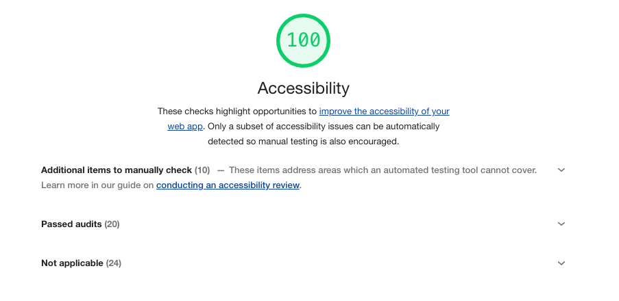

# 06 Color & Contrast

<!-- TOC -->

- [Find contrast issues](#find-contrast-issues)
- [Fix insufficient contrast](#fix-insufficient-contrast)
- [Fix too small text](#fix-too-small-text)
- [Run a final check](#run-a-final-check)
- [Bonus: Manual checks](#bonus-manual-checks)
  <!-- TOC -->

This last lab will show you how to improve **colors & contrast** in your app.

## Find contrast issues

Before you start, check for issues with your preferred tool (e.g. Lighthouse)! You should find some issues.

## Fix insufficient contrast

Fix insufficient contrast by changing the colors.

Additionally, think about adding a `text-decoration: underline` to your links. This is generally considered to be a good practice, because links without underline might not be easily recognizable.

Also since must users nowadays use touch devices, the hover state plays a less important role.

## Fix too small text

Make sure your text is at least `14px` large.

## Run a final check

Now run all your tools once more (on both pages) to find some leftover issues:

- ESLint
- Lighthouse, axe or Accessibility Insights
- and - last but not least - your favorite screen reader

Congratulations, you addressed common web accessibility issues in your Angular app! 🎉

## Bonus: Manual checks

Now run the Lighthouse A11y test once more and check this section **ADDITIONAL ITEMS TO MANUALLY CHECK (10)**.

If you find an issue, please let me know 😏
